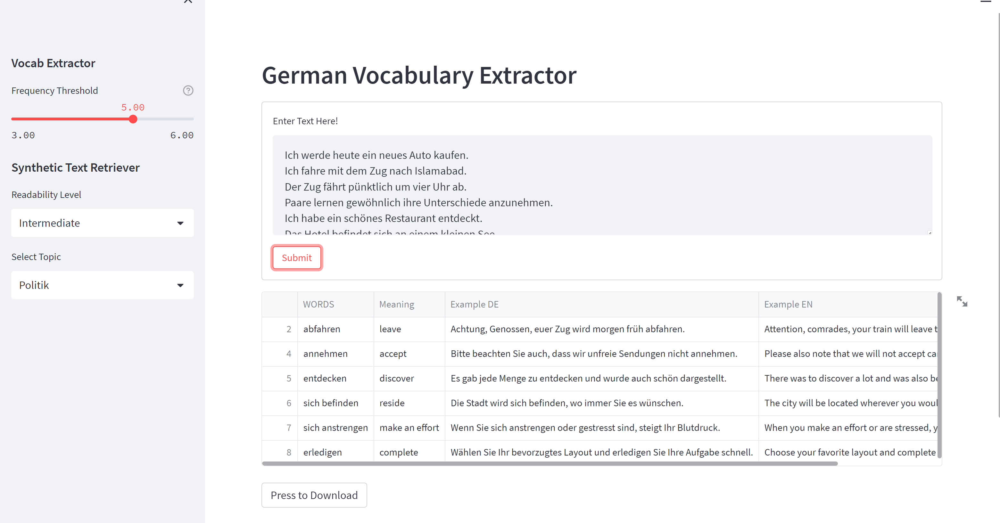
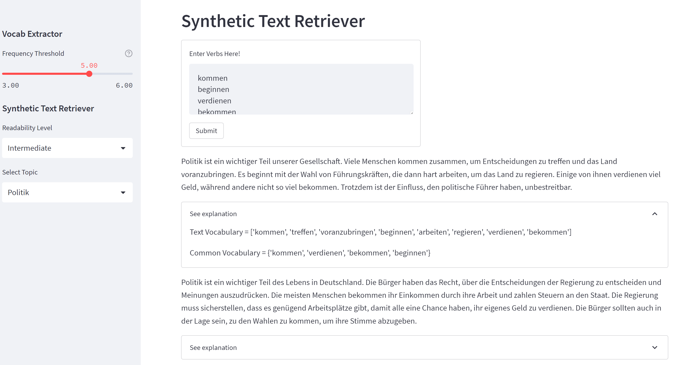
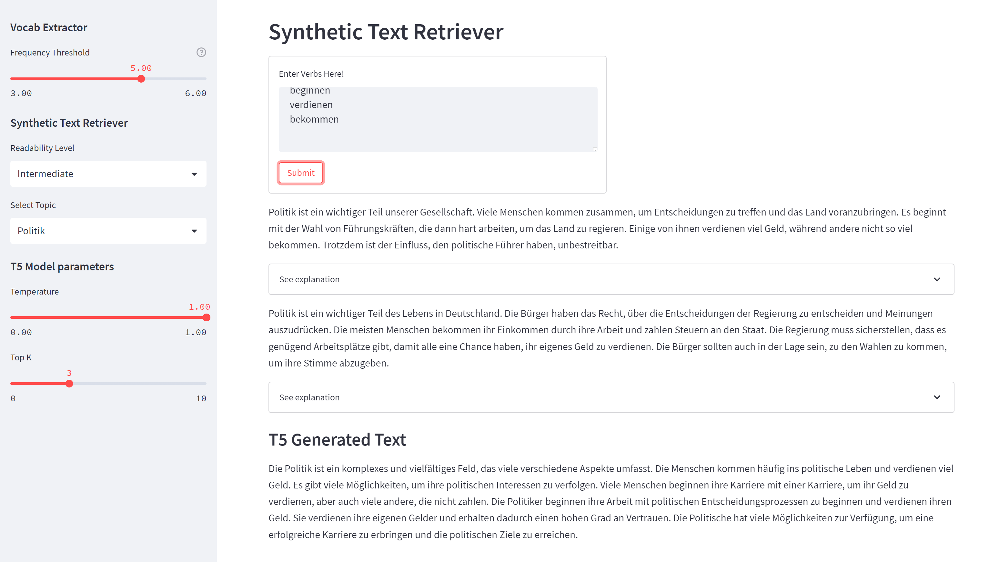

# DEExtract: A Customizable Context-Based German Vocabulary Learning Tool

### Abstract 


*Second language acquisition provides a lot of benefits, including cognitive development and intercultural understanding. We developed a tool to help German language learners, who have different proficiency levels, with vocabulary acquisition in context. The tool can extract and filter a verb vocabulary list from a piece of text according to the user’s proficiency level. Since vocabulary learning is effective in context, we also provide a feature to retrieve a synthetic paragraph using the verbs entered by the user. The synthetic paragraphs are generated using Generative modeling in two different topics namely, Politics and Economy, and at two different language readability levels.*


#### Verb Extraction:
---
Extract german verbs from text and filter them accodrding to users proficiency level. Words having frequecy greater than the `Frequency Theshold` will be ignored because they are easy and frequent. Set max threshold to include all possible words.   




#### Synthetic Text Retriver:
---
Use a list of verbs to retrieve sample texts on specific topic (Politics or Economy) at a two proficiency levels (Intermediate or Advanced).
 


# Package Installation

```bash
pip install -r requirements.txt
```

## Data Preparation:
Note: The data is already uploaded in the repository. Skip to [next](#Dashboard) section to start the dashboard

`dataset_prep.py`: Filter data from MLSUM dataset using topic names and use `VocabExtractor` to extract vocabulary. Further details are mentioned in 3.1 of the paper. The output is stored in `data/filtered_topics_{dataset_split_name}.json`

`chatgpt.py`: Generated synthetic using the extracted vocab from `data/filtered_topics_train.json` and store the result as `data/gpt_dataset_{cefr_level}.json`

`ìnverted_index.py`: Split the `data/gpt_dataset_{cefr_level}.json` by topic also `dataset_{topic}_{cefr_level}.json` and create inverted index `inverted_index{topic}_{cefr_level}.json`

## Dashboard
`lang_app.py`: Start the dashboard using the following command

```bash
streamlit run lang_app.py 
```

### Utils: 

`readability_score.py`: Calculate readability scores

## Text Generation Using T5

Note: This section is not part of the publication.

Use the vocabulary and topic to create a sythetic paragraph. The model was develeped as an alternative for the ChatGPT. However, the model sometimes does not generate coherent text.

`dataset_prep.py`: Prepare the dataset.

`train.py`: Train the T5 model

`predict.py`: Generate the text using some input topic and list of vocabulary. 



### Dataset Terms and Conditions:

Processed dataset is also avaliable as [HuggingFace Dataset](https://huggingface.co/datasets/femustafa/DEExtract). 

Dataset is created using ChatGPT and further use is permitted as long the use comply with the [Terms and Conditions](https://openai.com/policies/terms-of-use) of OpenAI.

### Cite

```bash
@INPROCEEDINGS{10391702,
  author={Mustafa, Faizan E},
  booktitle={2023 International Conference on Innovation and Intelligence for Informatics, Computing, and Technologies (3ICT)}, 
  title={DEExtract: A Customizable Context-Based German Vocabulary Learning Tool}, 
  year={2023},
  volume={},
  number={},
  pages={65-69},
  doi={10.1109/3ICT60104.2023.10391702}}

```


