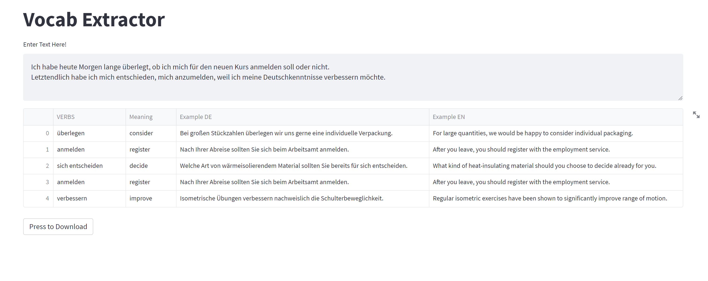

# German Vocabulary Extractor
Extract german vocabulary from text




## Run scripts

* Install packages.

```bash
pip install -r requirements.txt
```

* Run the streamlit app.

```bash
streamlit run lang_app.py 
```


## TODO

- [x] Connect with dictionary to fetch sentence examples
- [x] All words are not important. select less frequent words only.
- [ ] Add dative reflexive verbs
- [ ] Add nouns
- [x] Add adjectives
- [ ] Select a word meaning according to the context of the paragraph that user entered 
- [ ] Select the sentence according to the word translation selected 